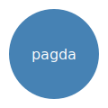

# Demo

A tiny example library. Its architecture, folded into the docs via
`docsAssets` and displayed right here:



```agda
module Demo where

-- A tiny self-contained module (no dependencies) so the example builds fast.
data Greeting : Set where
  hello : Greeting
```
